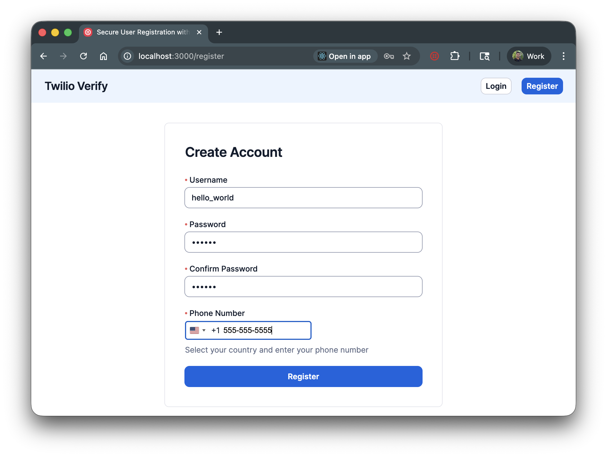

# Build a User Registration System with SMS Phone Verification

A Flask application with user registration, authentication, and SMS phone verification using Twilio Verify. Users create an account, verify their phone number via OTP, and access protected content.




## Set up

### Requirements

- [Python](https://www.python.org/) 3.9+
- [A Twilio Verify Service](https://console.twilio.com/?frameUrl=/console/verify/services)

### Twilio Account Settings

| Config Value | Description |
| :----------- | :---------- |
| TWILIO_ACCOUNT_SID | Your Twilio Account SID from the [Console](https://www.twilio.com/console) |
| TWILIO_AUTH_TOKEN | Your Twilio Auth Token from the [Console](https://www.twilio.com/console) |
| VERIFY_SERVICE_SID | Create a Verify Service [here](https://www.twilio.com/console/verify/services) |

### Local development

1. Clone this repository and `cd` into it.

   ```bash
   git clone git@github.com:twilio-samples/sms-phone-verification-python.git
   cd sms-phone-verification-python
   ```

2. Create a virtual environment and install dependencies.

   ```bash
   python -m venv venv
   source venv/bin/activate  # On Windows: venv\Scripts\activate
   pip install -r requirements.txt
   ```

3. Set your environment variables.

   ```bash
   cp .env.example .env
   ```

   Edit `.env` with your Twilio credentials.

4. Run the application.

   ```bash
   python app.py
   ```

5. Open http://localhost:5000 to register an account and verify your phone number.

## Resources

- [Twilio Verify API Documentation](https://www.twilio.com/docs/verify/api)
- [SMS Phone Verification CodeExchange Page](https://www.twilio.com/code-exchange/sms-phone-verification)